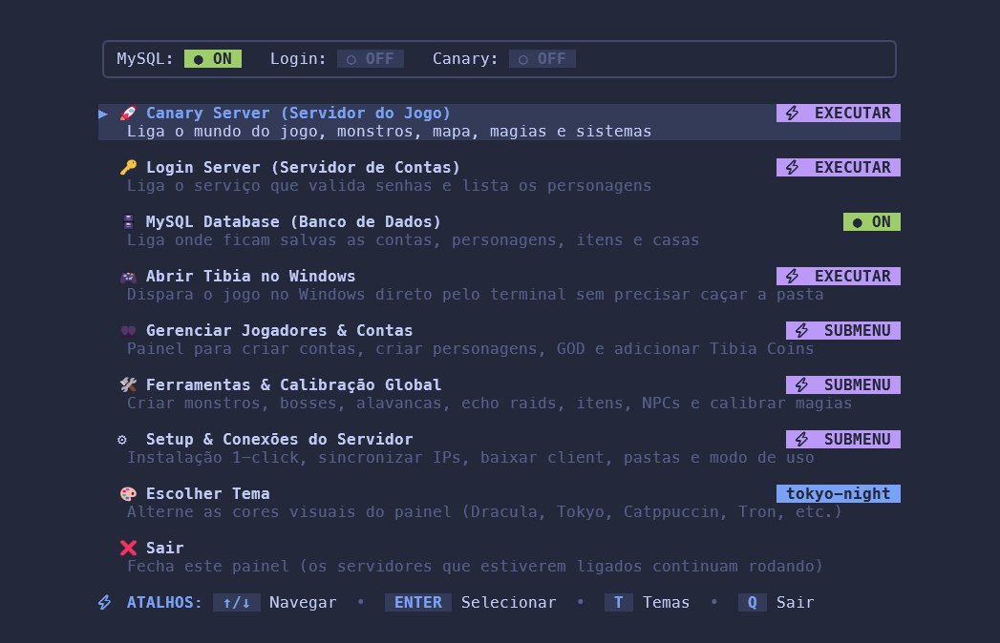
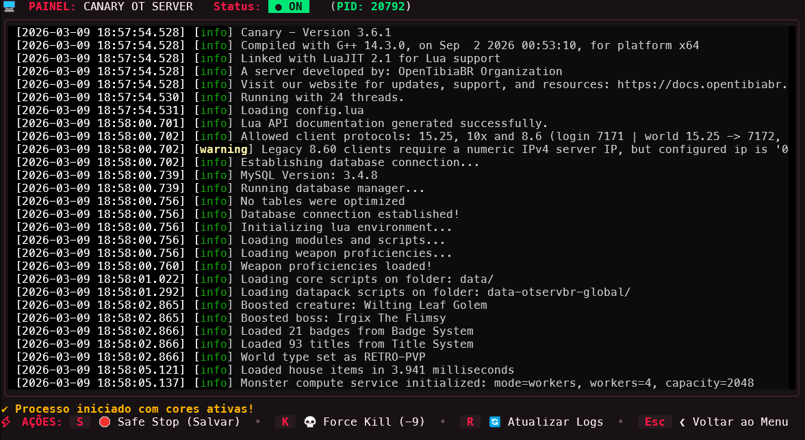
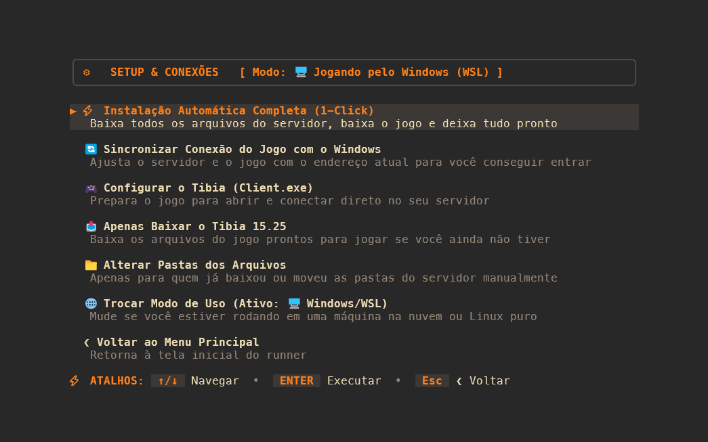
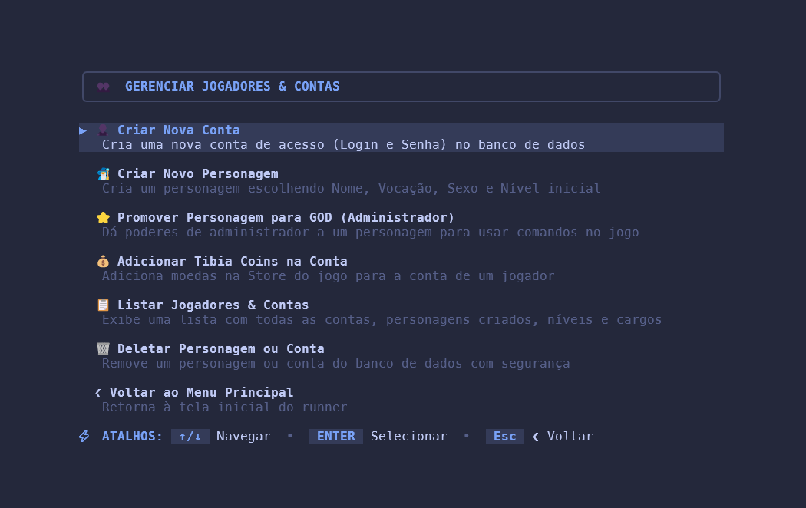
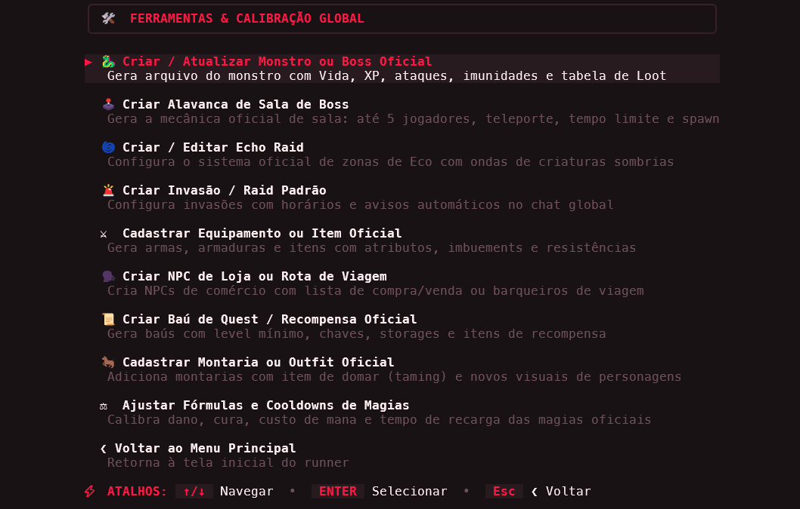

# ⚡ Canary Runner

<p align="center">
  <b>Chega de abrir 5 terminais e quebrar a cabeça com arquivos de configuração só para ligar um servidor de Tibia.</b>
</p>

<p align="center">
  O <b>Canary Runner</b> é um painel de controle visual e moderno feito para você <b>instalar, configurar, ligar, monitorar e jogar</b> o Canary OT Server (com Tibia 15.25) em um único lugar, sem complicações.
</p>

---

## 😫 Você só queria jogar, mas se deparou com isso...

Subir um servidor moderno de Tibia no seu computador (especialmente usando **Windows + WSL**) virou um processo cansativo e confuso:

* Ter que abrir **4 janelas de terminal** diferentes (uma pro Banco MySQL, uma pro Canary, uma pro Login Server e outra pro Patcher).
* Ter que abrir arquivos de texto estranhos pra quem não é desenvolvedor de software (`local.toml`, `config.lua`) e torcer para não errar uma vírgula.
* **Perder progresso e casas (Rollback)** ao fechar a janela do servidor na pressa sem o Canary salvar o mapa.
* Ter que instalar programas pesados de banco de dados só para criar uma conta ou colocar um personagem como **GOD**.
* Ter que instalar um monte de dependências, compilar, se deparar com vários erros e não conseguir rodar nem o servidor de testes.

---

## 🪄 Como o Canary Runner resolve tudo isso?

Com um único comando no terminal, você tem uma central completa:

```text
 🚀 Instalação 1-Click       -> Clona os projetos, baixa o Tibia 15.25 e extrai sozinho
 🖥️ Amigo do Windows (WSL)   -> Detecta seu IP sozinho e abre o Tibia.exe na tela do Windows
 🛑 Desligamento Seguro      -> Avisa o Canary para salvar mapa e jogadores antes de fechar
 👥 Gerenciador de Contas    -> Cria contas, personagens GOD e coloca Tibia Coins em segundos
 📜 Logs Coloridos ao Vivo   -> Acompanhe o servidor ligando em tempo real na mesma janela
 🎨 9 Temas Visuais          -> Escolha a paleta de cores que mais combina com seu estilo
```

---

## 🧑‍💻 Para desenvolvedores também!

Se você é dev e quer contribuir com a comunidade de Open Tibia, por que isso deveria ser tão sofrível? A cada update do Tibia chega um caminhão de atualizações, porém processos como editar monstros, outfits, npcs ou fórmulas são processos que sempre são repetidos, pra isso criamos ferramentas que facilitem tanto o dev como o entusiasta de OT Server.

---

## 🖥️ Espie como é por dentro

### 1. Menu Principal (Dia a dia descomplicado)
Tudo o que você precisa para controlar seu servidor com as setas do teclado:



---

### 2. Acompanhamento de Logs ao Vivo (Com Safe Shutdown)
Ao clicar no Canary ou Login Server, você vê o servidor subindo em tempo real com as cores originais:



> **Dica:** Apertando **`[S]`**, ele avisa o Canary para salvar todo o mundo e desconectar os jogadores com integridade antes de fechar. Sem sustos de *rollback*!

---

### 3. Painel de Setup & Configurações Automáticas
Seja jogando pelo Windows no WSL, em um servidor na nuvem ou em Linux puro, o menu se adapta ao que você precisa:



---

### 4. Gestão de Contas e GOD (Sem mexer em Banco de Dados)
Chega de instalar softwares pesados para gerenciar seu servidor local:



---

### 5. Personalização e Atualização
Editar ou criar monstros, spells, magias, cooldowns, itens, balanceamentos. Enfim, todas configurações que afetam a jogabilidade de um servidor:



---

## 🎨 Cores e Temas que Não Cansam a Vista

Pressione a tecla **`[T]`** a qualquer momento para alternar entre 9 temas modernos com suporte a **24-bit TrueColor**:

* 🧛 **Dracula** *(Roxo grafite clássico)*
* 🌌 **Tokyo Night** *(Azul escuro noturno)*
* 🌸 **Catppuccin Mocha** *(Tons pastéis confortáveis)*
* 🌊 **Nord Arctic** *(Azul ardósia glacial)*
* 🍂 **Gruvbox Dark** *(Retrô com tons de terra/madeira)*
* 🌊 **Kanagawa Wave** *(Estilo arte tradicional japonesa)*
* 💠 **Tron: Legacy** *(Azul néon futurista)*
* 🔴 **Tron: Ares** *(Vermelho obsidiana)*
* 📟 **Matrix** *(Verde terminal cyberpunk)*

*(O tema escolhido fica salvo para as próximas vezes que você abrir o painel!)*

---

## 🚀 Como Usar na sua Máquina

### 1. Requisitos Básicos
No seu terminal (Ubuntu no WSL ou Linux nativo), instale os pacotes básicos:

```bash
sudo apt update
sudo apt install -y golang-go git curl unzip mysql-server
```

### 2. Baixar e Rodar
```bash
# Clone este repositório
git clone https://github.com/seu-usuario/canary-runner.git
cd canary-runner

# Inicie o painel!
go run ./src
```

### 3. (Opcional) Abrir de qualquer lugar do terminal
Se quiser digitar apenas `canary-runner` em qualquer pasta:

```bash
go build -o canary-runner ./src
sudo mv canary-runner /usr/local/bin/

# Pronto! Agora basta digitar:
canary-runner
```

---

## ⌨️ Comandos do Teclado

* **`↑ / ↓`** ou **`k / j`**: Navega entre as opções
* **`ENTER`**: Entra no menu, liga o servidor ou executa a ação
* **`S`**: *Safe Stop* (Salva o mapa com segurança e desliga o servidor)
* **`K`**: *Force Kill* (Encerramento forçado caso o servidor trave)
* **`T`**: Abre o seletor de temas visuais
* **`R`**: Atualiza a tela de logs
* **`ESC`** ou **`B`**: Volta para o menu anterior
* **`Q`**: Fecha o painel *(o servidor continua rodando em segundo plano)*

---

<p align="center">
  Feito para simplificar a vida da comunidade <b>OpenTibia & Canary</b> ⚡
</p>